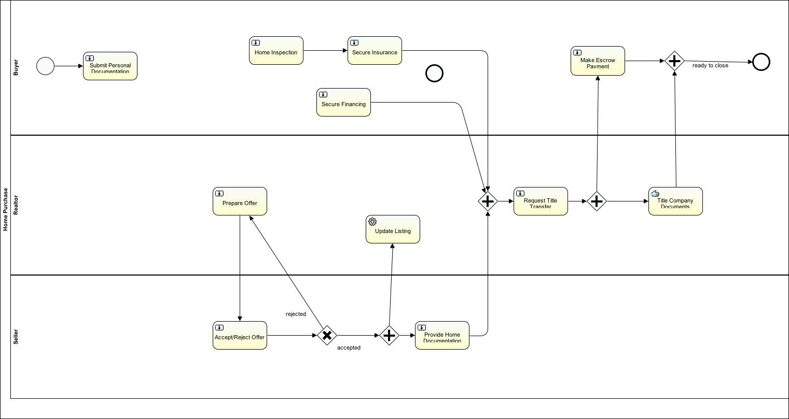

Presentation at the Tampa Java Users Group on 8/27/15
http://www.meetup.com/Tampa-JUG/events/222813410/

---

# Activiti: A developer-friendly process engine

Evolved from jBPM, Activiti is an open-source workflow and process engine for Java. Unlike big-vendor BPM platforms that are traditionally bloated and targeted at business analysts, Activiti is developer-oriented, light-weight, easy to learn and manage.

Modeling your processes in Activiti makes them self-documenting, organized, and manageable. Process state is persisted to a database which creates a convenient audit log to know what happened when and can even be the basis for a Business Intelligence (BI) tool. 

Activiti processes are modeled using an Eclipse plugin and managed using a simple web application. The runtime engine can either be deployed as a WAR or embedded into your Java application. An optional REST interface allows for language-agnostic and remote interaction with the process management API.

This presentation will be an overview of Activiti and the concepts involved, followed by a demo of how to model, deploy, execute, and monitor a process. 

http://www.slideshare.net/TravisCarlson/activiti-a-developerfriendly-process-engine

